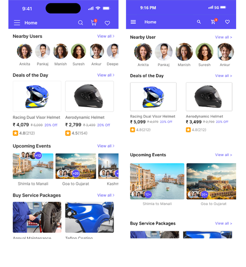

# Bike Ride Sharing App UI

## About the project

This project is a User Interface (UI) conversion of a Bike Ride Sharing application user interface(UI) based on figma design. It purely focuses on frontend UI part of the application using flutter. 

## Comparison Between the Design and the Project

### Home Page

### Care Page

## A Quick Demo of the Project

## Resources 

&rarr; 
